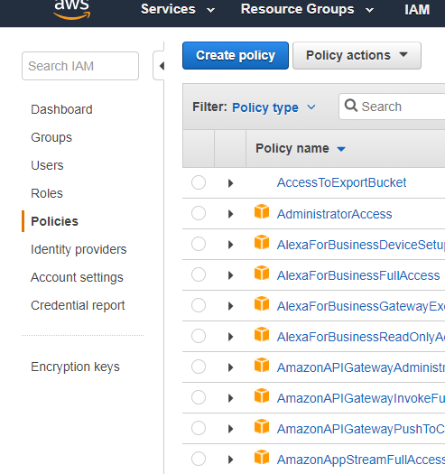
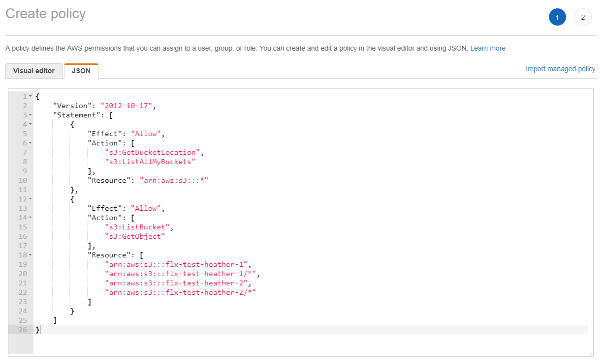
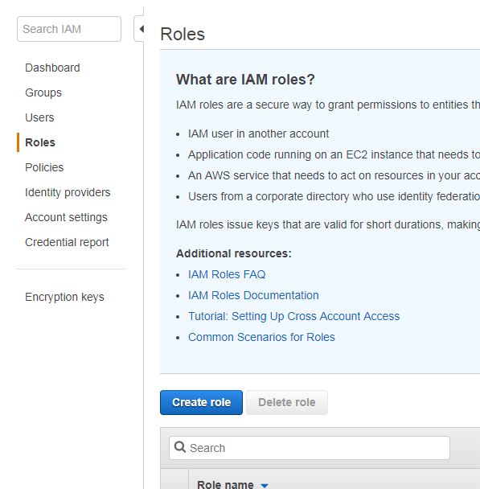
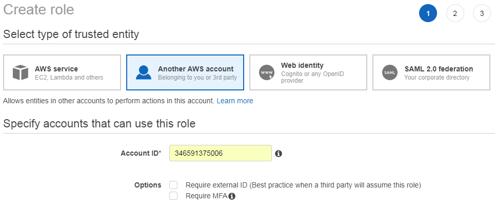
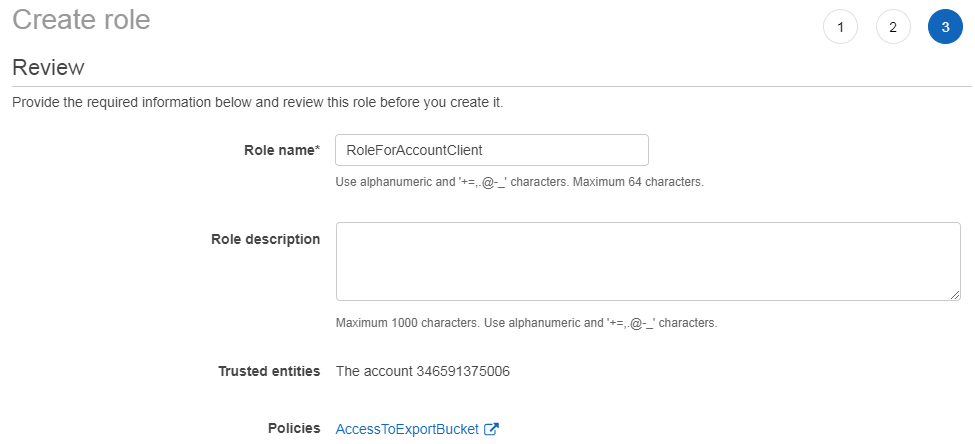
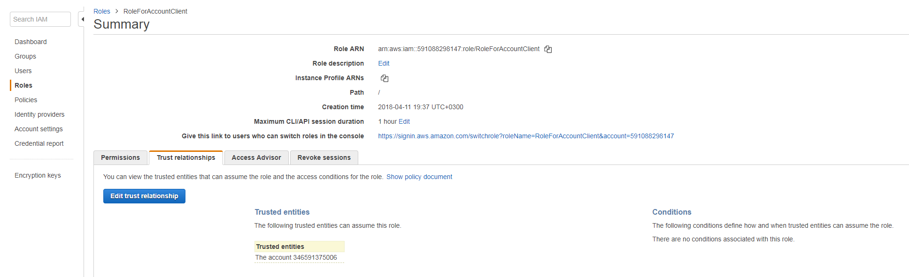
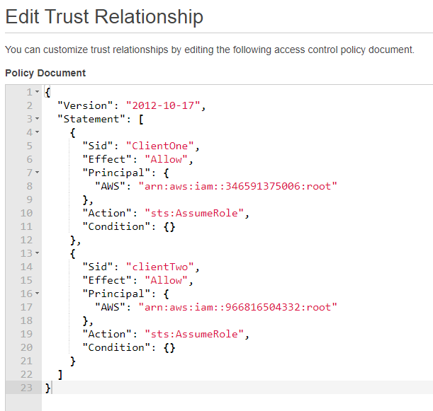

# Permission setting

    **Note**
    1. Please keep in mind distinction between `account` - the organization and `user` - the individual
    2. Our `export` account (named `unpaywall` in the following document) is an account created to hold the export buckets only, no other resources are allocated here.

1. [Clients new to AWS](#permissions-for-clients-new-to-aws):  Set up a new user in our export account and add user to relevant group to allow reading from specific bucket.

2. [Clients with existing AWS account](#permissions-for-clients-with-existing-aws-accounts): Grant cross-account permission to their account to read from specific bucket.


## Permissions for clients new to AWS

TODO

## Permissions for clients with existing AWS accounts

### Overview

An AWS account — for example, Account `unpaywall` — can grant another AWS account, Account `client`, permission to access its resources such as buckets and objects. Account `client` can then delegate those permissions to users in its account.

1. Account `unpaywall` administrator creates a policy `AccessToExportBucket` to allow access to export bucket
2. Account `unpaywall` administrator creates a role `RoleForAccountClient` for root of account `client`
3. Account `unpaywall` administrator attach policy `AccessToExportBucket` to role `RoleForAccountClient` to allow access to export bucket
4. Account `client` administrator creates a policy to allow specific users to assume the `RoleForAccountClient` role
5. User in account `client` verifies permissions by accessing an object in the bucket owned by Account `unpaywall`.

All the tasks of creating users and granting permissions are done in the AWS Management Console. To verify permissions, the walkthrough uses AWS Management Console. For information about using the command line tools, AWS Command Line Interface (CLI) and AWS Tools for Windows PowerShell, please see [Assuming a Role](https://docs.aws.amazon.com/cli/latest/userguide/cli-roles.html) in AWS Command Line Interface documentation.


### Create `AccessToExportBucket` policy

 As an account `unpaywall` administrator goto to IAM -> Policies -> Create Policy:



Add the following statements:

```
{
    "Version": "2012-10-17",
    "Statement": [
        {
            "Effect": "Allow",
            "Action": [
                "s3:GetBucketLocation",
                "s3:ListAllMyBuckets"
            ],
            "Resource": "arn:aws:s3:::*"
        },
        {
            "Effect": "Allow",
            "Action": [
                "s3:ListBucket",
                "s3:GetObject"
            ],
            "Resource": [
                "arn:aws:s3:::flx-test-heather-1",
                "arn:aws:s3:::flx-test-heather-1/*",
                "arn:aws:s3:::flx-test-heather-2",
                "arn:aws:s3:::flx-test-heather-2/*"
            ]
        }
    ]
}
```



Review and create policy. When you need to update buckets or rights just go and edit the policy.


### Create `RoleForAccountClient` role and attach policy


 As an account `unpaywall` administrator goto to IAM -> Roles -> Create Role:



Add the client account id:


This is required only when creating the role. When we need to add another account we will edit the role policy

Attach the policy to allow access to S3:


Create the role:


### Adding other client accounts

To add another accounts to trust relation, an account `unpaywall` administrator should goto to IAM -> Roles:



Edit trust relationship and add as many accounts as needed, then update the trust policy:

```
{
    "Version": "2012-10-17",
    "Statement": [
        {
            "Sid": "ClientOne",
            "Effect": "Allow",
            "Principal": {
                "AWS": "arn:aws:iam::346591375006:root"
            },
            "Action": "sts:AssumeRole",
            "Condition": {}
        },
        {
            "Sid": "clientTwo",
            "Effect": "Allow",
            "Principal": {
                "AWS": "arn:aws:iam::966816504332:root"
            },
            "Action": "sts:AssumeRole",
            "Condition": {}
        }
    ]
}
```
Using this format will allow minimal documentation of permissions granted




### Account `client` administrator tasks

Account `client` administrator creates a policy to allow specific users to assume the `RoleForAccountClient` role:

```
{
  "Version": "2012-10-17",
  "Statement": [
    {
      "Effect": "Allow",
      "Action": "sts:AssumeRole",
      "Resource": [
        "arn:aws:iam::591088298147:role/RoleForAccountClient"
      ]
    }
  ]
}
```

For instructions, see [Working with Inline Policies](http://docs.aws.amazon.com/IAM/latest/UserGuide/access_policies_inline-using.html) in the IAM User Guide.

### Client user assume role

The client user can use the link to switch role:

https://signin.aws.amazon.com/switchrole?roleName=RoleForAccountClient&account=591088298147

Or they can follow the steps bellow:

1. Sign-in to the AWS Management Console as the `client` account user who was granted permissions in the preceding procedure. For example, you can use the IAM console at https://console.aws.amazon.com/iam/.

2. In the upper-right corner, choose the link that contains your current sign-in name, and then choose **Switch role**.

3. Type the account ID number `591088298147`and role name `RoleForAccountClient`

4. For **Display Name**, type the text that you want to show on the navigation bar in the upper-right corner in place of your user name while you are using the role. You can optionally select a color.

5. Choose **Switch Role**. Now, all actions that you perform are done with the permissions granted to the role that you switched to. You no longer have the permissions associated with your original IAM user until you switch back.

6. When you are done performing actions that require the permissions of the role, you can switch back to your normal IAM user by choosing the role name in the upper-right corner (whatever you specified as the **Display Name**), and then choosing **Back to UserName**.
